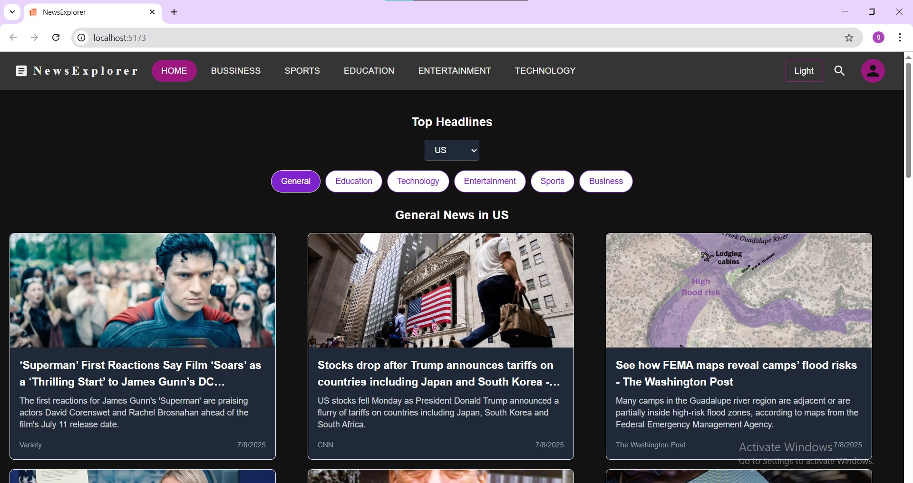

### 📸 App Screenshots

#### 1. Homepage


#### 2. Category View


#### 3. Country Selection


#### 4. Search Function


#### 5. Loading State


#### 6. Dark Mode


#### 7. Error Message


# React + Vite

This template provides a minimal setup to get React working in Vite with HMR and some ESLint rules.

Currently, two official plugins are available:

- [@vitejs/plugin-react](https://github.com/vitejs/vite-plugin-react/blob/main/packages/plugin-react) uses [Babel](https://babeljs.io/) for Fast Refresh
- [@vitejs/plugin-react-swc](https://github.com/vitejs/vite-plugin-react/blob/main/packages/plugin-react-swc) uses [SWC](https://swc.rs/) for Fast Refresh

---

## 📰 News App — Features

This project is a simple news aggregator that fetches top headlines using the [NewsAPI](https://newsapi.org).

### ✨ Features:
- View top news headlines by **category**
- Switch between different **countries** 
- Fully responsive and styled with **Tailwind CSS and MAterialUi** 
- Supports **light/dark mode**
- Displays loading indicators and error messages
- Built with **React + Redux Toolkit + Vite**
-implemented searchfunction using everything url 
-implemented loader if data is fetching
---

## 🔐 API Key Setup (NewsAPI)

To run this app, you need a free API key from [https://newsapi.org](https://newsapi.org).

### Steps:

1. Go to [https://newsapi.org](https://newsapi.org) and sign up
2. Get your API key (e.g. `123456abcdef`)
3. Create a `.env` file in the root of your project:

```env
VITE_NEWS_API_KEY=your_api_key_here
